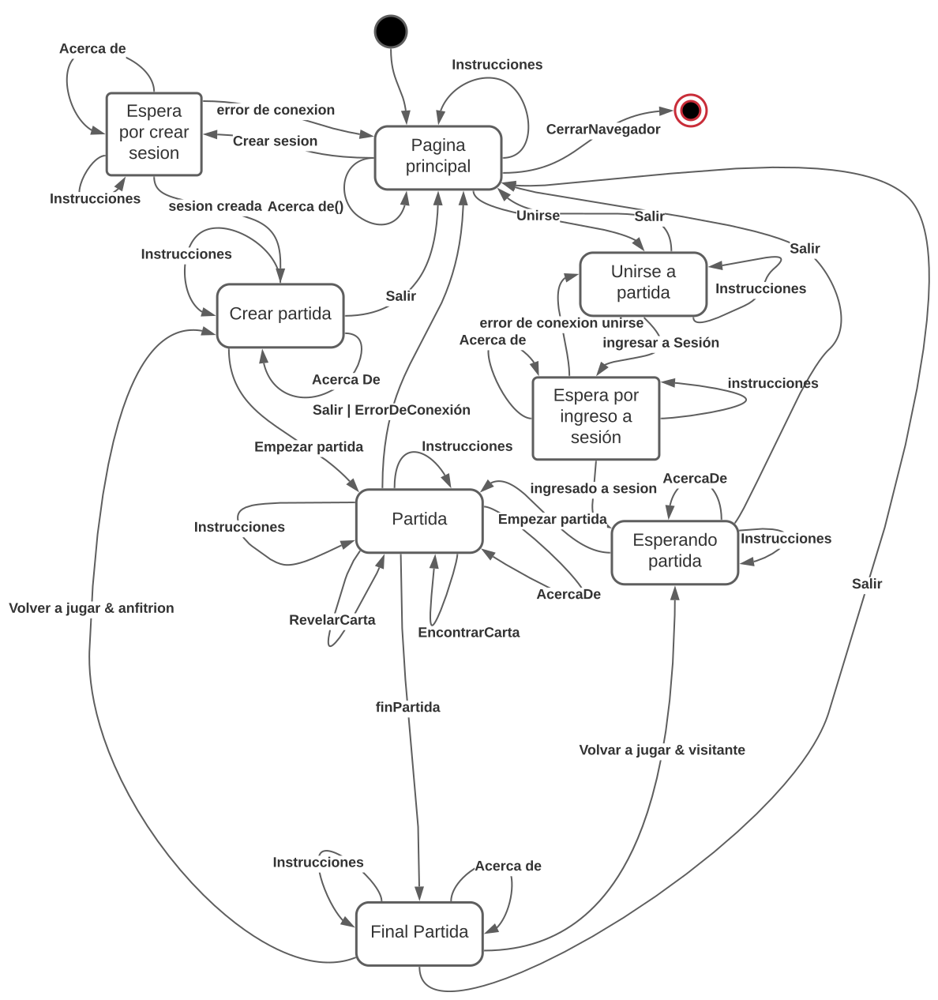
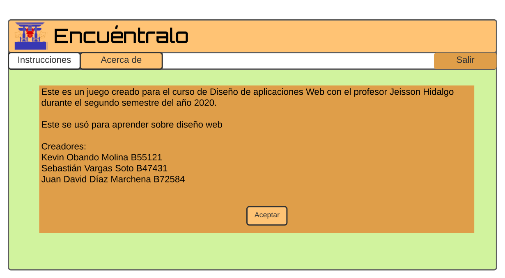
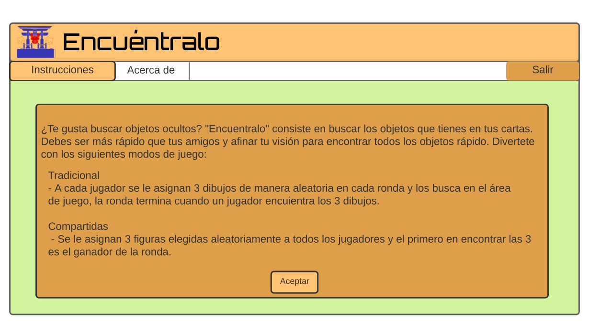
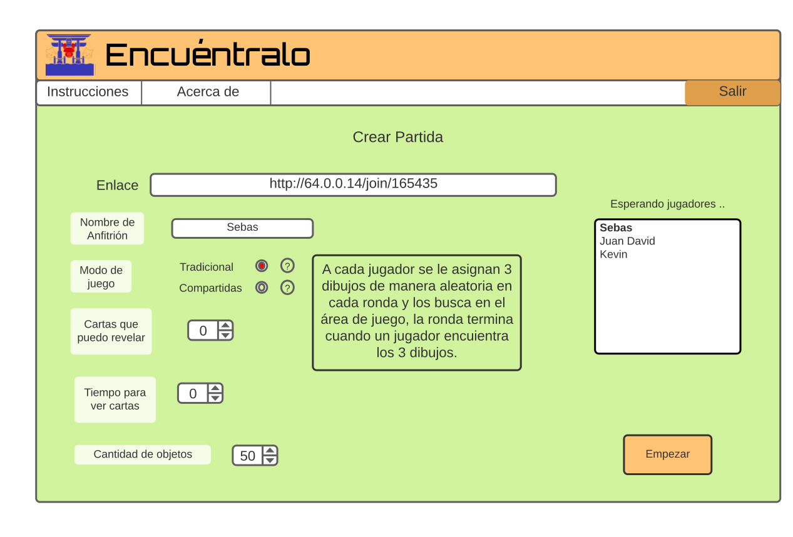
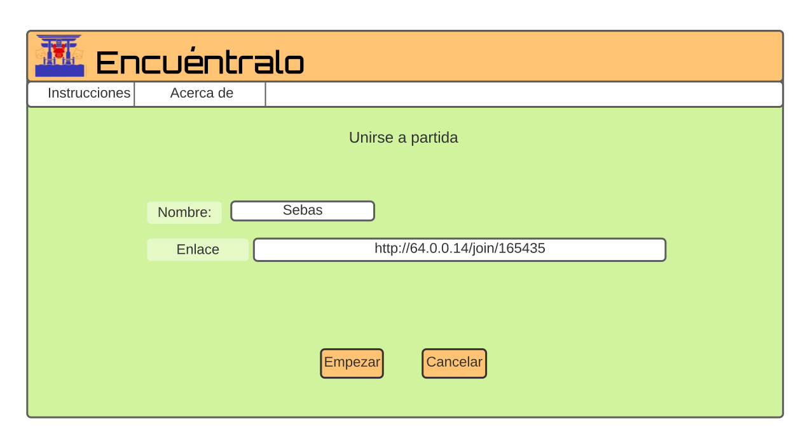
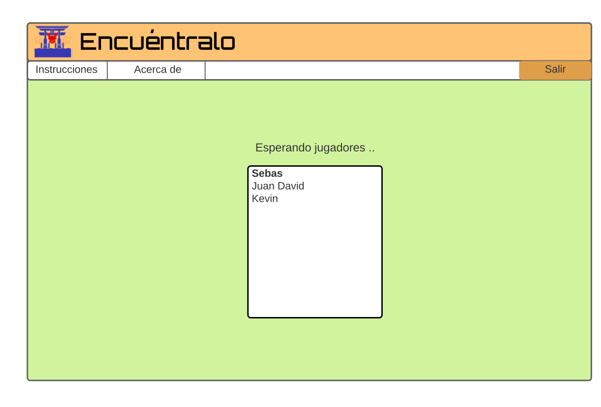
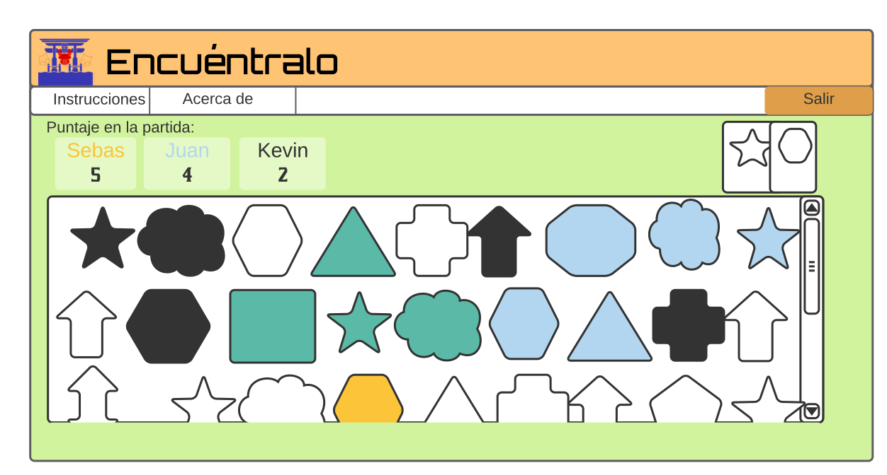
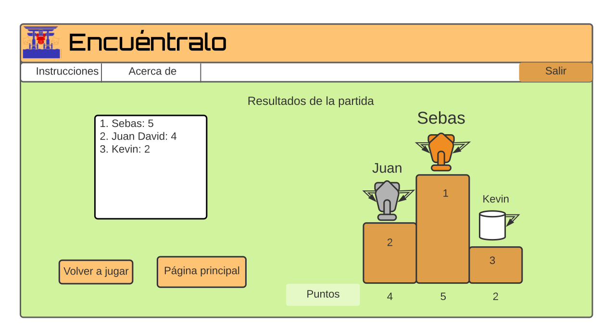

# Diseño de la Interfaz
Este archivo contiene el diseño final de la interfaz, contiene dos secciones, diseño de la interfaz y diseño distruibuido. 
## Parte 1: Diseño de la interfaz
En esta sección se encuentran las imágenes finales del diseño de interfaz, estas son capturas del juego en funcionamiento:
### Pantalla de inicio 

En esta pantalla se encuentran dos botones, uno para crear un partida nueva y otro para unirse a una con un código ya existente.
### Pantalla de acerca de

Esta es la pantalla de acerca de, esta pantalla informativa esta en ese botón en todas las pantallas del juego, esta provee información general sobre la creación del juego.
### Pantalla de instrucciones

Esta es la pantalla de instrucciones, esta pantalla informativa esta en ese botón en todas las pantallas del juego, esta provee información sobre los objetivos del juego, variaciones y modos.
### Pantalla de crear partida

En esta pantalla se crea una partida nueva, se configuran los parametros y se genera el código que es que permite que otros jugadores se unan, como se puede ver a lado derecho esta la lista con los jugadores que se van uniendo, los que estan listos tienen check, cuando todo esta listo se presiona empezar para iniciar la partida.
### Pantalla de unirse

A esta pantalla se accede desde el botón de unirse en la pantalla de inicio, aqui los invitados deben ingresar su nombre y el código de la partida que se genero en la pantalla del host, cuando se ingresaron los datos se presiona empezar para ir a la sala de espera de los invitados.

### Pantalla de espera de los invitados 

A esta pantalla se accede desde el botón de empezar en la pantalla de unirse, aqui esperan los jugadores invitados mientras inicia la partida. 
### Pantalla de partida 

Esta es la pantalla de la patida, en la parte superior derecha se encuentran las cartas que se deben buscar, se debe hacer click sobre ellas para revelarlas, cuando se encuentre en la manta la figura se hace click y se aumenta el puntaje en los marcadores.
### Pantalla de fin de partida 

Esta es la pantalla que surge cuando se cumplan los puntos necesarios para terminar las ronda y las rondas necesarias para terminar la partida, en esta pantalla además de los marcadores hay un botón para volver a jugar, en el caso del hospedador este va a la pantalla de configuración y los invitados van a la pantalla de espera.
## Parte 2: Diseño distruibuido
### Protocolo de paso de mensajes
Los mensajes que se intercambian son en formato .Json, a continuación se describe el protocolo: 
```
// from: client host
// to: server
// when: Cuando se presiona el botón de crear partida.

{
  "nombreMensaje": "Crear",
}

// from: server
// to: client host
// when: cuando se crea la sesion
//Respuesta del servidor al anfitrión con el código de la partida
{
  "nombreMensaje": "SesionCreada",
  "codigo": 124146,
  "codigoEmisor": 4762394,
  "palyers": ["Juan", "Kevin"],
}

// from: host
// to: server
// when: Le quita el focus al espacio del nombre
{
  "nombreMensaje": 'nombreAnfitrion',
  "codigo":window.sessionStorage.getItem('codigo'),
  "nombreA":nombreOwner,
}

// from: client guest
// to: server
// when: Cuando se presiona el botón de unirse en la pantalla de unirse
{
  "nombreMensaje": "Unirse",
  "codigo": 124146,
  "nombreInvitado": "Juan",
}

// from: client guest
// to: server
// when: el cliente envía un codigo de una sesion pero el servidor no puede agregarlo
{
  "nombreMensaje": "ErrorAlUnirse",
}

// from: Server
// to: cliente guest
// when: introdujo un condigo invalido
{
  "nombreMensaje": 'ErrorCodigoInvalido',
}
// from: server
// to: clients
//when: cuando un visitante se une a la sesion
{
  "nombreMensaje": "AgregadoASesion",
  "host": "Sebas",
  "guest": [ "Juan", "Kevin" ],
  "codigoEmisor": 4762394,
  "jugadores": ["Juan", "Kevin"],
}

// from: client host
// to: server
// when: el host presiona el boton de empezar en la patanlla de crear partida
{
  "nombreMensaje": "Iniciar",
  "chancesToReveal": 1,
  "revealTimer": 4,
  "numberOfImages": 80,
  "owner": "",
  "modo": 1,
  "codigoEmisor": 4762394,
  "codigo": 234255,
  "jugadores": ["Juan", "Kevin"],
}

//from: clients
//to: server
//when: el cliente cambia de pagina y crea un nuevo socket o conexion
{
  "nombreMensaje": "ActualizarSocket",
  "codigo": 12345,
  "codigoEmisor": 2135612,
  "estado": "listoPartida",
}
// from: server
// to: clients
// when: cuando inicia la ronda
{
  "nombreMensaje": "Ronda",
  "player": {
    "name": [],
    "score": []
  },
  "Rug": [],
  "delete": [],
  "cards": [],
  "jugadores": ["Juan", "Kevin"],
}


// from: jugador
// to: server
// when: Cuando un jugador encuentra una carta
{
  "nombreMensaje": "EncontrarCarta",
  "id": 2,
  "nombre": "tortuga",
  "codigoEmisor": 2135612,
  "estado": "listoPartida",
}


// from: server
// to: jugadores
// when: Cuando un jugador encuentra una carta
{
  "nombreMensaje": "Ronda",
  "player": {
    "name": [],
    "score": []
  },
  "Rug": [],
  "delete": [],
  "cards": [],
  "jugadores": ["Juan", "Kevin"],
}

// from: server
// to: jugadores
// when: cuando la partida termina 
{
  "nombreMensaje": "Terminar",
  "name": [],
  "score": [],
  "host": "sebas",
  "jugadores": ["Juan", "Kevin"],
}

// from: client host
// to: server
// when: el anfitrión vuelve a la página principal
{
  "nombreMensaje": "Salir",
  "codigo": 2135612,
}

// from: server
// to: jugadores
// when: cuando el host se sale de la partida
{
  "nombreMensaje": "HostDesconectado",
}

// from: client guest
// to: server
// when: el anfitrión vuelve a la página principal
{
  "nombreMensaje": "Desconectar",
  "codigo": 2135612,
  "codigoEmisor": 2135612,
}
// from: server
// to: jugadores
// when: un jugador invitado se sale, sirve para actualizar 
// la lista de jugadores en crear
{
  "nombreMensaje": "SalioSesion",
  "jugadores": ["Juan", "Kevin"],
}

// from: server
// to: jugadores
// when: El server recibe un mensaje de listo de algun jugador
{
  "nombreMensaje": "Listo",
  "jugadores": ["Juan", "Kevin"],
}

// from: cliente invitado
// to: host
// when: un jugador presiono que quiere volver a jugar en 
// la pantalla de fin de partida 
{
  "nombreMensaje": "Listo",
  "jugadores": ["Juan", "Kevin"],
  "codigo": 2135612,
  "codigoEmisor": 4,
}
```
### Máquina de estados


### Wireframe 
Estos fueron los diseños que se hicieron al inicio y sobre los cuales se trabajo para hacer la versión final que se ve al inicio.
### Pantalla de inicio 

En esta pantalla se encuentran dos botones, uno para crear un partida nueva y otro para unirse a una.
### Pantalla de acerca de

Esta es la pantalla de acerca de, esta pantalla informativa esta en ese botón en todas las pantallas del juego, esta provee información general sobre la creación del juego.
### Pantalla de instrucciones

Esta es la pantalla de instrucciones, esta pantalla informativa esta en ese botón en todas las pantallas del juego, esta provee información sobre los objetivos del juego, variaciones y modos.
### Pantalla de crear partida

En esta pantalla se crea una partida nueva, se configuran los parametros y se genera el código que es que permite que otros jugadores se unan, como se puede ver a lado derecho esta la lista con los jugadores que se van uniendo, cuando todo esta listo se presiona empezar para iniciar la partida.
### Pantalla de unirse

A esta pantalla se accede desde el botón de unirse en la pantalla de inicio, aqui los invitados deben ingresar su nombre y el código de la partida que se genero en la pantalla del host, cuando se ingresaron los datos se presiona empezar para ir a la sala de espera de los invitados.

### Pantalla de espera de los invitados 

A esta pantalla se accede desde el botón de empezar en la pantalla de unirse, aqui esperan los jugadores invitados mientras inicia la partida. 
### Pantalla de partida 

Esta es la pantalla de la patida, en la parte superior derecha se encuentran las cartas que se deben buscar, se debe hacer click sobre ellas para revelarlas, cuando se encuentre en la manta la figura se hace click y se aumenta el puntaje en los marcadores.
### Pantalla de fin de partida 

Esta es la pantalla que surge cuando se cumplan los puntos necesarios para terminar las ronda y las rondas necesarias para terminar la partida, en esta pantalla además de los marcadores hay un botón para volver a jugar, en el caso del hospedador este va a la pantalla de configuración y los invitados van a la pantalla de espera.


